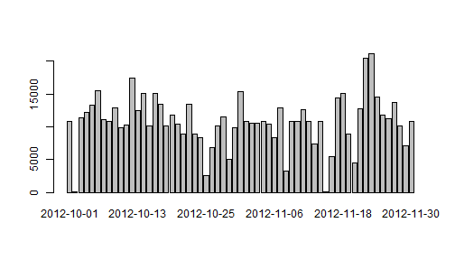

# Reproducible Research: Peer Assessment 1


## Loading and preprocessing the data
First I loaded the data using read.csv  

```r
    activityData<-read.csv("activity.csv")
```

I didn't do any other pre-processing of the data.


## What is mean total number of steps taken per day?
I used tapply() to sum the total steps by day and then used mean() and median() making sure to remove missing values  

```r
    totals<-tapply(activityData$steps,activityData$date,sum)
    mean<-mean(totals,na.rm=TRUE)
    median<-median(totals,na.rm=TRUE)
```

Here is a histogram of the totals using the base barplot() function  

```r
  barplot(totals)
```

 


The mean total number of steps is 1.0766 &times; 10<sup>4</sup>. The median total number of steps is 10765 

## What is the average daily activity pattern?

I used tapply() again, this time to get the mean number of steps taken by interval and the sort() function to get the maximum average.  

```r
    averageSteps<-tapply(activityData$steps,activityData$interval,mean,na.rm=TRUE)
    sortAverage<-sort(averageSteps,decreasing=T)
    maxAverage<-names(sortAverage[1])
```
Here's a time series plot using the base plot() function with type="l"  

```r
    plot(averageSteps,type="l",xaxt="n",xlab="time interval",ylab="steps",main="average daily number of steps by 5-minute time interval")
    axis(1,at=1:288,labels=names(averageSteps))
```

 

The five minute interval with the highest average number of steps is 835.


## Imputing missing values
First I use sum() and is.na() to get the total number of rows with missing data:

```r
    sum<-sum(is.na(activityData))
```
The number of rows with missing data in the activity dataset is 2304.  

To impute missing values, I used the mean for that 5 minute interval taken from averageSteps. The following code creates a copy of activityData, namely activityData2 and uses averageSteps to replace all missing values with the interval mean. 

```r
    activityData2<-activityData
    for(i in 1:17568){
        if(is.na(activityData2$"steps"[i])){
        activityData2$"steps"[i]<-averageSteps[as.character(activityData2$"interval"[i])]
        }
    }
    totals2<-tapply(activityData2$steps,activityData2$date,sum)
    mean2<-mean(totals2)
    median2<-median(totals2)
```
Here is the revised histogram with imputed missing values:  

```r
  barplot(totals2)
```

 

The new mean is  1.0766 &times; 10<sup>4</sup> and the new median is  1.0766 &times; 10<sup>4</sup>.  

The new values are the same as previously, except for the median value now being equal to the mean. This is as expected bevcause I have chosen a strategy to replace missing values based on the average across the whole dataset, therefore the averages are largely unaffected.  


## Are there differences in activity patterns between weekdays and weekends?
I used the weekdays() funtion to classify each date into a weekday or a weekend and add this as a factor variable into a new dataset activityData3  

```r
    weekpart<-c()
    weekend<-c("Saturday","Sunday")
    for(i in 1:17568){
        if(weekdays(as.Date(activityData2$"date"[i])) %in% weekend){
            weekpart[i]<-"weekend"
        }
        else {
            weekpart[i]<-"weekday"
        }
    }
    activityData3<-cbind(activityData2,weekpart)
```
I then used tapply on a list of factors (weekpart and then interval) to prepare my data  

```r
    averageSteps2<-tapply(activityData3$steps,list(activityData3$weekpart,activityData3$interval),mean,na.rm=TRUE)
```
and then plot time series using the base plot() funtion and par() to create the panels  

```r
    par(mfrow=c(2,1),mar=c(2,2,2,2)) 
    plot(averageSteps2[1,],type="l",xaxt="n",main="weekday")
    axis(1,at=1:288,labels=names(averageSteps2[1,]))
    plot(averageSteps2[2,],type="l",xaxt="n",main="weekend")
    axis(1,at=1:288,labels=names(averageSteps2[2,]))
```

 

